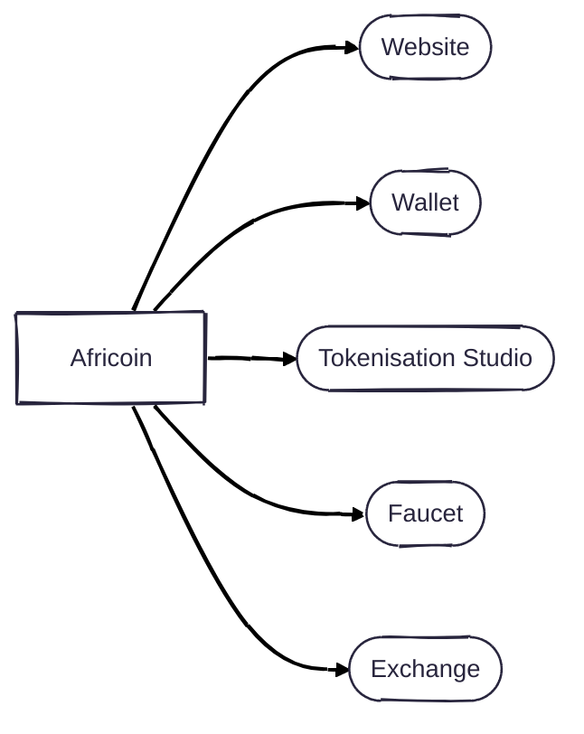

```mermaid

---
config:
  theme: redux
  layout: dagre
  look: handDrawn
---
flowchart LR
    start["Africoin"]
    
    website(["Website"])
    wallet(["Wallet"])
    studio(["Tokenisation Studio"])
    faucet(["Faucet"])
    exchange(["Exchange"])

    start --> website & wallet & studio & faucet & exchange

```
