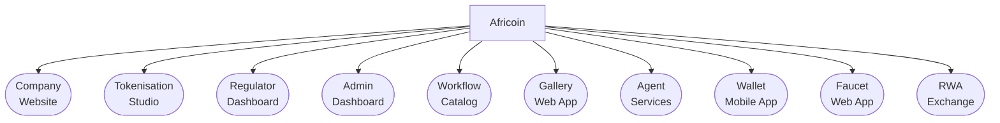

# Africoin

  
### Website
TBD

### Tokenisation Studio
TBD

### Regulator Dashboard
TBD

### Admin Dashboard
TBD

### Workflow Catalog
TBD

### Gallery
TBD

### Agent Services
TBD

### Wallet Mobile App
TBD

### (RWA) Exchange
TBD
