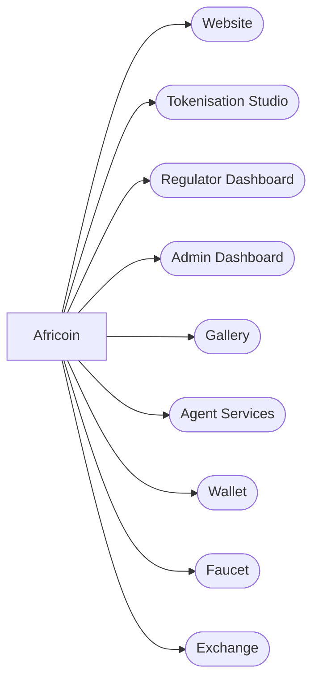

# Africoin Services

```mermaid

---
config:
  theme: normal
  layout: dagre
---
flowchart LR
    start["Africoin"]
    
    website(["Website"])
    click website "https://github.com/AfricoinAI/website" _blank

    studio(["Tokenisation Studio"])
    click studio "https://github.com/AfricoinAI/tokenisation-studio" _blank

    regulator_dashboard(["Regulator Dashboard"])

    admin_dashboard(["Admin Dashboard"])

    gallery(["Gallery"])

    ai_services(["Agent Services"])

    wallet(["Wallet"])

    faucet(["Faucet"])

    exchange(["Exchange"])

    start --> website & studio & regulator_dashboard & admin_dashboard & gallery & ai_services & wallet & faucet & exchange

```
